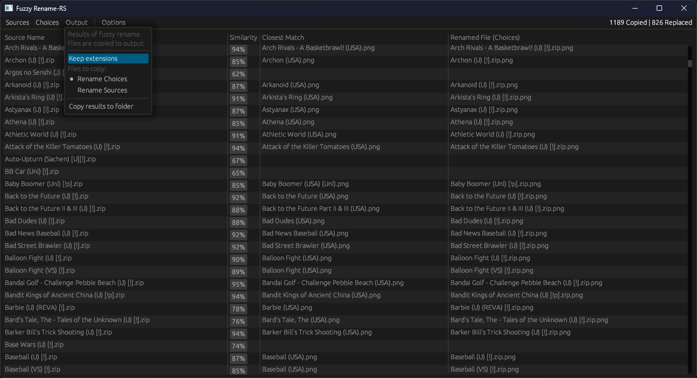

# Fuzzy Rename-RS

Base template: [eframe_template](https://github.com/emilk/egui/tree/master/crates/eframe)

Renames a group of files to match the most similar from another group. Helpful for pairing data with images.

Written in Rust!
